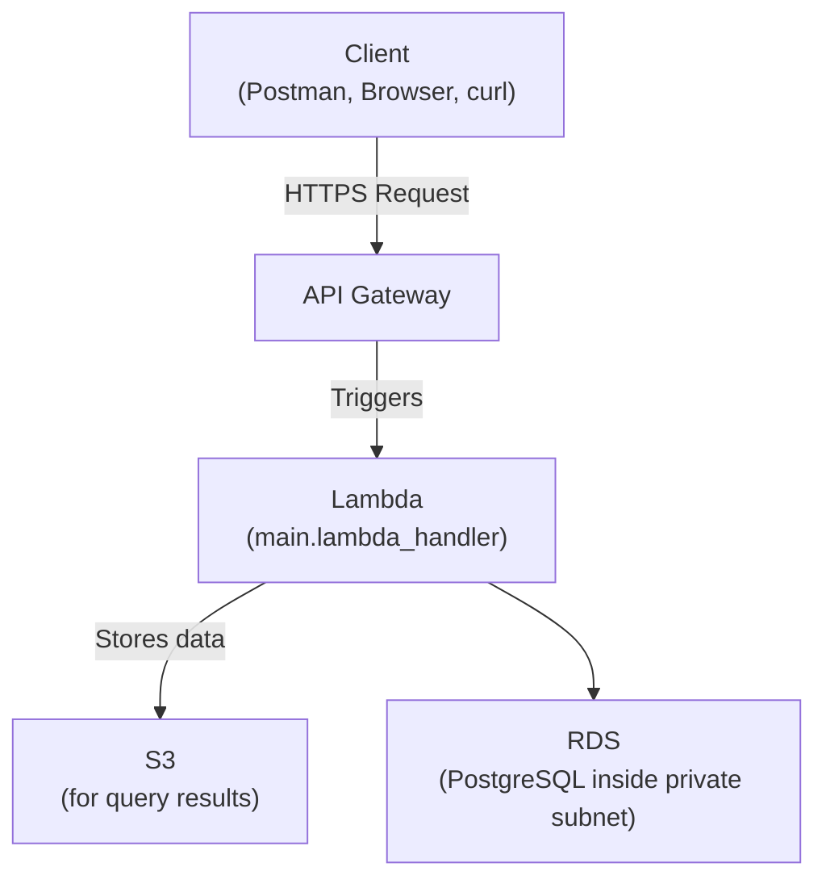
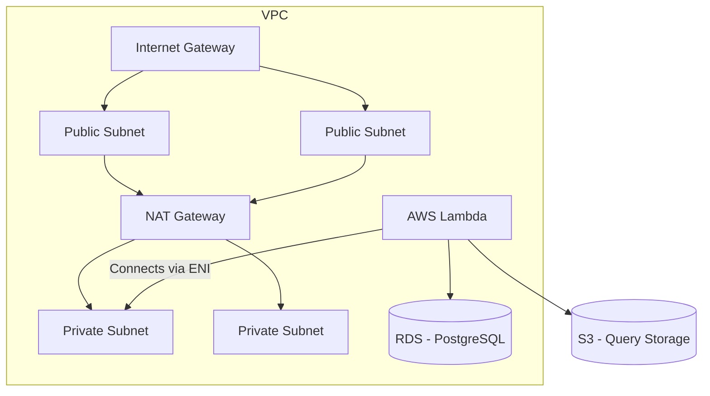
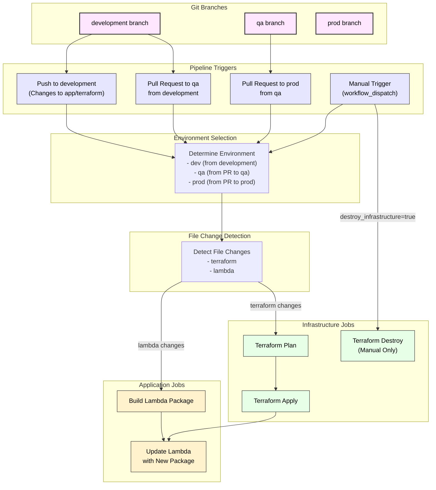

# DevOps Documentation for API Application

This document outlines the steps needed for initial setup, deployment, architecture, and Git flow.

## Git Flow

---

## Infrastructure Architecture and Workflow



### AWS Resources



---

## Initial Setup Steps

1. **Create a GitHub Actions Role in AWS**

```json
{
  "Version": "2012-10-17",
  "Statement": [
    {
      "Sid": "AllowAllActions",
      "Effect": "Allow",
      "Action": [
        "s3:*",
        "ecr:*",
        "lambda:*",
        "apigateway:*",
        "iam:*",
        "logs:*",
        "secretsmanager:*",
        "ec2:*",
        "rds:*"
      ],
      "Resource": "*"
    }
  ]
}
```

2. **Create an OIDC Provider**: `token.actions.githubusercontent.com`

3. **Update the role with this trust relationship**:

```json
{
  "Version": "2012-10-17",
  "Statement": [
    {
      "Effect": "Allow",
      "Principal": {
        "Federated": "arn:aws:iam::<ACCOUNT ID>:oidc-provider/token.actions.githubusercontent.com"
      },
      "Action": "sts:AssumeRoleWithWebIdentity",
      "Condition": {
        "StringEquals": {
          "token.actions.githubusercontent.com:aud": "sts.amazonaws.com"
        },
        "StringLike": {
          "token.actions.githubusercontent.com:sub": "repo:<repo owner>/devops-home-task:*"
        }
      }
    }
  ]
}
```

GitHub Actions can now interact with AWS. Adjust the policy as needed.

---

## Terraform Structure

Enterprise module structure:

```bash
.
├── config
│   ├── dev.tfvars
│   └── qa.tfvars
├── environments
│   ├── dev
│   │   ├── backend.tf
│   │   ├── main.tf
│   │   ├── outputs.tf
│   │   └── variables.tf
│   ├── prod
│   └── qa
├── modules
│   ├── api_gateway
│   ├── ecr
│   ├── iam
│   ├── lambda
│   ├── rds
│   ├── s3
│   └── vpc
└── plans
```

---

## CI/CD Workflow



### Security Scan (Bandit)

```bash
- name: Run Python security scan (Bandit)
  id: bandit-scan
  run: |
    pip install bandit
    bandit -r ./app -f json -o bandit_report.json || true
    cat bandit_report.json

    ISSUE_COUNT=$(jq '.results | length' bandit_report.json)

    if [ "$ISSUE_COUNT" -gt 0 ]; then
      echo "scan_passed=false" >> $GITHUB_OUTPUT
    else
      echo "scan_passed=true" >> $GITHUB_OUTPUT
    fi
```

---

## Statefile and Lock Table Bootstrapping

```hcl
terraform {
  backend "s3" {
    bucket         = "terraform-state-bmoldo-devops-home-task"
    key            = "terraform/dev/terraform.tfstate"
    region         = "us-east-1"
    encrypt        = true
    dynamodb_table = "terraform-locks-dev"
  }
}
```

---

## Local Terraform Deployment Guide

### Prerequisites
- AWS CLI
- Terraform
- Make
- GitHub repo

### Configuration Variables

| Variable | Description | Default |
|----------|-------------|---------|
| ENV | Environment | dev |
| ACCOUNT_ID | AWS Account ID | 070503547773 |
| REPO_OWNER | GitHub owner | your-github-owner |
| REPO_NAME | GitHub repo | your-repository-name |
| API_URL | API healthcheck | None |
| TF_LOG | Terraform log level | error |

### Directory Structure

```
terraform/
├── bootstrap/
├── config/
│   ├── dev.tfvars
│   └── prod.tfvars
├── environments/
│   ├── dev/
│   └── prod/
├── plans/
placeholder_lambda/
Makefile
```

### Makefile Commands

| Command | Description |
|---------|-------------|
| `make init` | Init and sync remote state |
| `make bootstrap` | Setup backend infra |
| `make lambda-package` | Build and upload Lambda zip |
| `make plan` | Terraform plan |
| `make apply` | Terraform apply |
| `make destroy` | Destroy infra |
| `make healthcheck` | Ping API |
| `make clean` | Clean artifacts |

### Deployment Flow

```bash
export REPO_OWNER=your-github-username
export REPO_NAME=your-repo-name
export ACCOUNT_ID=your-aws-account-id

make bootstrap ENV=dev
make init ENV=dev
make lambda-package ENV=dev
make plan ENV=dev
make apply ENV=dev
make healthcheck API_URL=https://your-api-endpoint
```

---

## Alternative Pipeline Option

Directory: `.github/separate-workflows/`

```
├── actions/
│   └── setup-aws-terraform/
│       └── action.yml
├── infrastructure-pipeline.yml
├── lambda-workflow.yml
├── python-scan.yml
├── terraform-workflow.yml
```

Separate pipelines trigger based on changes in respective folders.

---

## Suggested Improvements

- Send TF plan & Bandit results to Slack
- Slack notifications on PR creation
- Dynamic healthcheck analysis
- Add custom DNS for API

